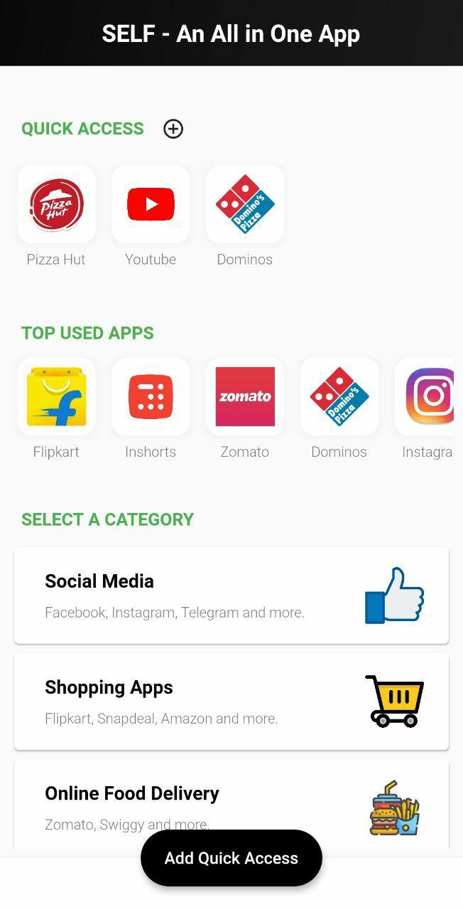
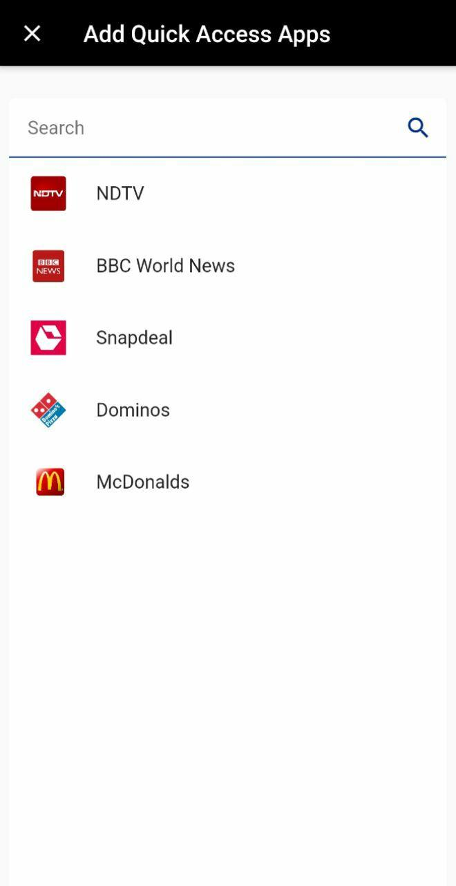
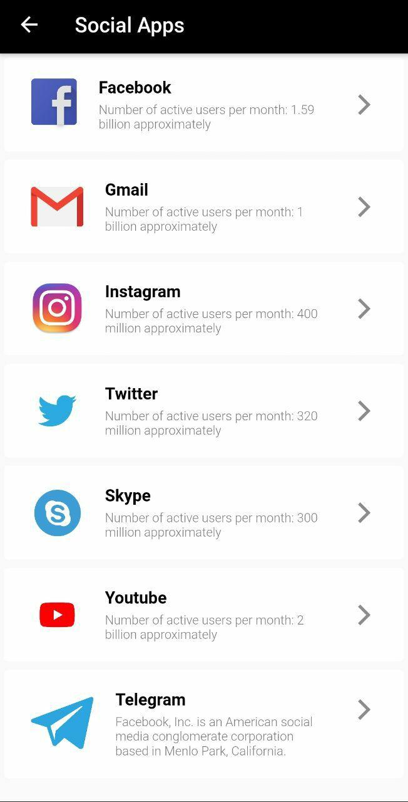
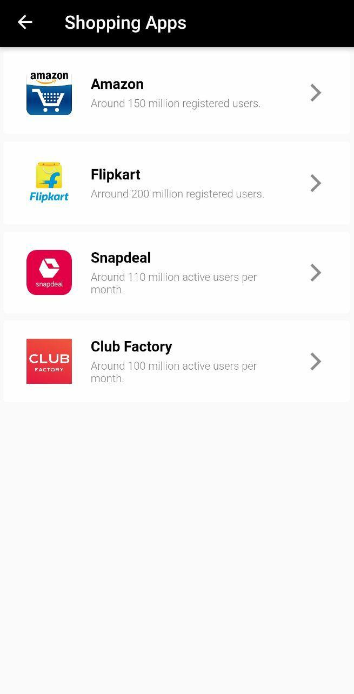
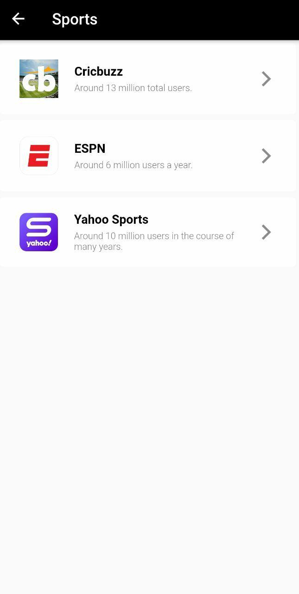

# Self
An all in one mobile application having social, shopping, news and sports apps in one place! 

# Flutter App Screenshots
### Dashboard

### Add Quick Access Apps

### Social Media Apps

### Shopping Apps

### Sports Apps

### News Apps

# External Plugin used
<a href="https://pub.dev/packages/flutter_webview_plugin">flutter_webview_plugin 0.3.11</a>

<a href="https://pub.dev/packages/shared_preferences">shared_preferences 0.5.8</a>

# Todo
- ~~Implementing Favourite Section~~
- Implementing Most used apps for every user
- Notifications
- Adding location permissions for webView
- Adding DRM for online streaming apps

